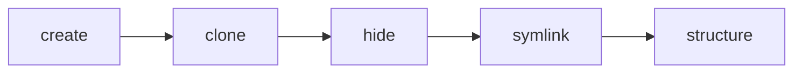

# Brainstorming the API

> Below is the original brainstorming API which I used to craft the actual API

[Back to README](../README.md)

## Functions in procedural order



| Name                      | Params                | Description              |
| :------------------------ | :-------------------- | :----------------------- |
| [Create](#createrootpath) | String(`pathToSpace`) | Designate repospace root |
| [Clone](#clone)           | Array(`repos`)        | Clone all github repos   |
| [Hide](#hide)             | undefined             | Move repos to hidden dir |
| [Symlink](#symlink)       | String(`pathToRepos`) | Param implicit from hide |
| [Structure](#structure)   | Object(`structure`)   | Move syms to dirs        |

---

### Examples

---

#### `create(rootPath)`

Use empty directory to store cloned repos and symlinks to those repos. Eventually, these symlinks will be added and this repospace will be used as the "root" directory which connects to all related repos.

**Input**

> ```js
> let rootPath = path.join(process.cwd(), "repospaceXYZ");
> ```

**Call**

> ```js
> repospace.create(rootPath);
> ```

**Return**

> | Type    | Message                             |
> | :------ | :---------------------------------- |
> | Success | String("/path/to/repospaceXYZ")     |
> | Fail    | `Failed to create repospace ${err}` |

---

#### `clone([...repos])`

Clone all of the specified repos.

**Input**

> ```js
> let repos = [
>   {
>     name: "foo",
>     url: "github.com/servexyz/foo"
>   },
>   {
>     name: "bar",
>     url: "github.com/servexyz/bar"
>   }
> ];
> ```

**Call**

> ```js
> repospace.create("repospaceXYZ").clone(...repos);
> ```

**Return**

> | Type    | Return                               |
> | :------ | :----------------------------------- |
> | Success | String(`path/to/${...createdRepos}`) |
> | Fail    | Boolean(false)                       |

---

#### `hide()`

Hide all of the cloned repositories. This will also be added to .gitignore

**Input**

> Not applicable

**Call**

> ```js
> repospace
>   .create("repospaceXYZ")
>   .clone(...repos)
>   .hide();
> ```

**Return**

> | Type    | Return         |
> | :------ | :------------- |
> | Success | Boolean(true)  |
> | Fail    | Boolean(false) |

---

#### `symlink(pathToRepos)`

Generate symlinks to represent each cloned repository inside hidden directory.

**Input**

> ```js
> symlink("path/to/hidden/repos");
> ```

**Call**

> ```js
> repospace
>   .create("repospaceXYZ")
>   .clone(...repos)
>   .hide();
>   .symlink("path/to/hidden/repos");
> ```

**Return**

> | Type    | Return         |
> | :------ | :------------- |
> | Success | Boolean(true)  |
> | Fail    | Boolean(false) |

#### `structure({layout})`

**Input**

`Layout` - Concept

> ```js
> let layout = {
>   repospaceXYZ: [
>     "index.js",
>     {
>       docs: {
>         images: ["api_brainstorm.jpg", "foobar.gif"]
>       }
>     }
>   ]
> };
> ```

`Layout` - Structure

```js
//input =>
const sample_repospace = {
  namespace: {
    singleRepoDir: {
      name: "baz",
      url: "github.com/xyz/baz"
    },
    multiRepoDir: [
      {
        name: "foo",
        url: "github.com/xyz/foo"
      },
      {
        name: "bar",
        url: "github.com/xyz/bar"
      }
    ]
  }
};

//output =>
${namespace}/
  ${singleRepoDir}/
    ${baz}/
  ${multiRepoDir}/
    ${foo}/
    ${bar}/
```

> Note: Run structure through JSON.parse. Screws up markdown format to include JSON.parse(``);

**Call**

> ```js
> repospace
>   .create("repospace")
>   .clone(...repos)
>   .hide();
>   .symlink();
>   .structure(layout);
> ```

**Return**

> | Type    | Return         |
> | :------ | :------------- |
> | Success | Boolean(true)  |
> | Fail    | Boolean(false) |

---
